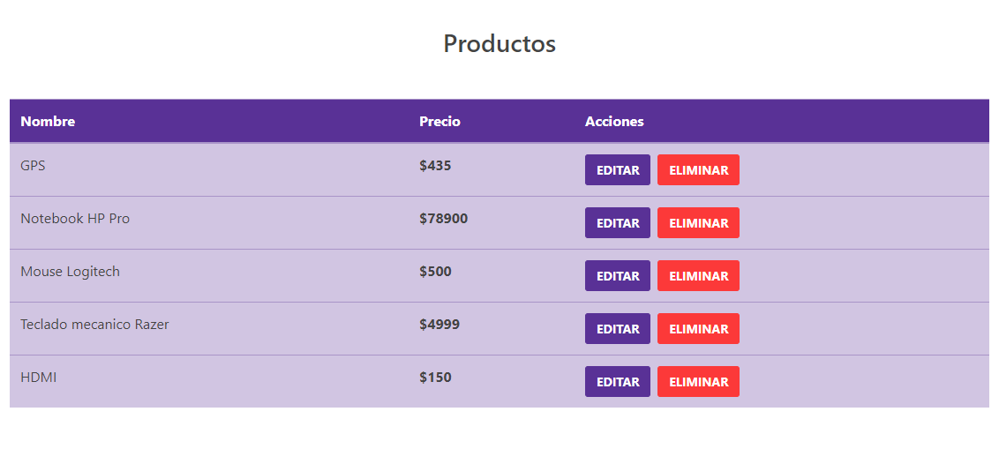

T# Shoppi App
#### Lucas Angelino - [https://github.com/lucasangelino](https://github.com/lucasangelino)

Shoppi is a very basic SPA, created for learning porpuses. It's a Shop administrator, were the admin is able to add, edit and delete a list of products. In the upcoming versions product images and details will be added.

## API
None

## Database
This app uses a local fake database created using fake-server. 

### **Run the App**

#### Visit: 
[Shoppi App]()

#### Or do the following: 
1. Download the repo and go into its folder
2. Run a terminal in the folder and execute **"npm install"** and **npm i json-server**
4. Open a second terminal and run **json-server db.json --port 4000**
5. Enjoy the app

#### This is how the App looks like:

